# NodeJS CRUD REST API

Repository ini dibuat untuk memenuhi **Tugas Praktikum Node.js & Express.js**. Project ini adalah REST API sederhana yang menerapkan operasi **CRUD** (Create, Read, Update, Delete) untuk data Kategori dan Produk.

## 👤 Identitas
* **Nama:** Muzaqi Nur Arifin
* **NIM:** 24090132
* **Kelas:** 3D

## 🛠️ Teknologi
* **Node.js** (Runtime Environment)
* **Express.js** (Web Framework)
* **MySQL** (Database)
* **mysql2** (Database Driver)
* **dotenv** (Environment Variables)

## 📂 Struktur Project
```text
nodejs-crud-restapi/
├── config/
│   └── db.js      # Konfigurasi koneksi database
├── controller/
│   ├── categoryController.js
│   ├── productController.js
|   └── userController.js
├── images/
|   └── ...
├── node_modules/
|   └── ...
├── routes/
│   └── Route.js         # Main routing
├── .env                 # Konfigurasi environment (DB credentials)
├── package-lock.json
├── package.json         # Dependencies
├── server.js            # Entry point
└── README.md            # Dokumentasi project

```

## Cara Menjalankan Project

Ikuti langkah-langkah di bawah ini untuk menjalankan project di komputer lokal (Localhost).

### 1. Persiapan Database (MySQL)
Buat database baru dengan nama `tugas_crud_api` dan jalankan query SQL berikut di **phpMyAdmin** atau SQL Client lainnya untuk membuat tabel:

```sql
CREATE DATABASE tugas_crud_api;

USE tugas_crud_api;

-- 1. Tabel Categories
CREATE TABLE categories (
    id INT AUTO_INCREMENT PRIMARY KEY,
    name VARCHAR(100) NOT NULL,
    created_at TIMESTAMP DEFAULT CURRENT_TIMESTAMP,
    updated_at TIMESTAMP DEFAULT CURRENT_TIMESTAMP ON UPDATE CURRENT_TIMESTAMP
);

-- 2. Tabel Products
CREATE TABLE products (
    id INT AUTO_INCREMENT PRIMARY KEY,
    category_id INT,
    name VARCHAR(100) NOT NULL,
    price DECIMAL(10, 2) NOT NULL,
    created_at TIMESTAMP DEFAULT CURRENT_TIMESTAMP,
    updated_at TIMESTAMP DEFAULT CURRENT_TIMESTAMP ON UPDATE CURRENT_TIMESTAMP,
    FOREIGN KEY (category_id) REFERENCES categories(id) ON DELETE SET NULL
);

-- 3. Tabel Users
CREATE TABLE users (
    id INT AUTO_INCREMENT PRIMARY KEY,
    name VARCHAR(255) NOT NULL,
    email VARCHAR(255) NOT NULL UNIQUE,
    password VARCHAR(255) NOT NULL,
    created_at TIMESTAMP DEFAULT CURRENT_TIMESTAMP,
    updated_at TIMESTAMP DEFAULT CURRENT_TIMESTAMP ON UPDATE CURRENT_TIMESTAMP
);

```

### 2. Instalasi Dependensi
Buka terminal di dalam folder project, lalu jalankan perintah:

```bash
npm install

```

### 3. Konfigurasi Environment
Buat file bernama `.env` di folder root (sejajar dengan `server.js`), lalu isi dengan konfigurasi berikut:

```env
PORT=3000
DB_HOST=localhost
DB_USER=root
DB_PASS=
DB_NAME=tugas_crud_api

```

*(Catatan: Jika MySQL kamu menggunakan password, isi `DB_PASS` dengan password tersebut. Jika XAMPP default, biarkan kosong).*

### 4. Menjalankan Server
Jalankan perintah berikut untuk memulai server:

```bash
node server.js

```

Jika berhasil, akan muncul pesan:

```
Server berjalan di http://localhost:3000
MySQL Connected!

```

---

## 🔗 Dokumentasi API Endpoint
Gunakan **Postman** atau **Insomnia** untuk melakukan testing pada URL berikut:

### 📦 Categories (Kategori)
| Method | Endpoint | Deskripsi | Body Request (JSON) |
| --- | --- | --- | --- |
| **GET** | `/api/categories` | Lihat semua kategori | - |
| **GET** | `/api/categories/:id` | Lihat detail kategori | - |
| **POST** | `/api/categories` | Tambah kategori | `{ "name": "Elektronik" }` |
| **PUT** | `/api/categories/:id` | Edit kategori | `{ "name": "Gadget" }` |
| **DELETE** | `/api/categories/:id` | Hapus kategori | - |

### 🛒 Products (Produk)
| Method | Endpoint | Deskripsi | Body Request (JSON) |
| --- | --- | --- | --- |
| **GET** | `/api/products` | Lihat semua produk | - |
| **GET** | `/api/products/:id` | Lihat detail produk | - |
| **POST** | `/api/products` | Tambah produk | `{ "category_id": 1, "name": "Laptop", "price": 5000000 }` |
| **PUT** | `/api/products/:id` | Edit produk | `{ "category_id": 1, "name": "Laptop Pro", "price": 7000000 }` |
| **DELETE** | `/api/products/:id` | Hapus produk | - |

###  Users (user)
| Method | Endpoint | Deskripsi | Body Request (JSON) |
| --- | --- | --- | --- |
| **GET** | `/api/users` | Lihat semua user | - |
| **GET** | `/api/users/:id` | Lihat detail user | - |
| **POST** | `/api/users` | Tambah user | `{"name": "Muzaqi Nur Arifin", "email" : "muzaqi.nurar4@gmail.com", "password" : "dfjkdskjfkldsj"}` |
| **PUT** | `/api/users/:id` | Edit user | `{"name": "Muzaqi Nur Arifin", "email" : "muzaqi.nurar4@gmail.com", "password" : "ganti password" }` |
| **DELETE** | `/api/users/:id` | Hapus user | - |
---

## 📸 Screenshot Hasil Testing

1. **Cek Keberhasilan Server**
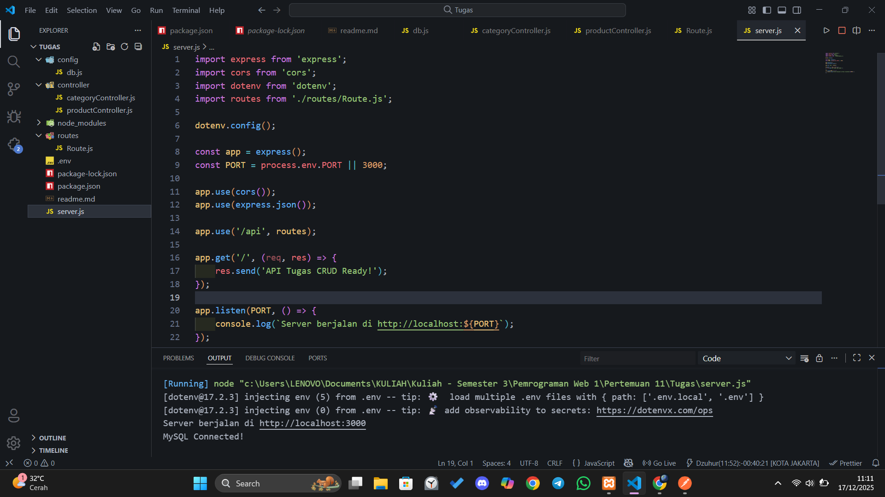

2. **POST Category**
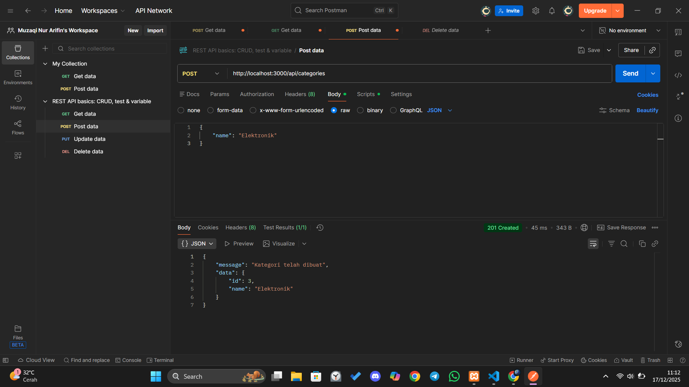

3. **GET All Categories**
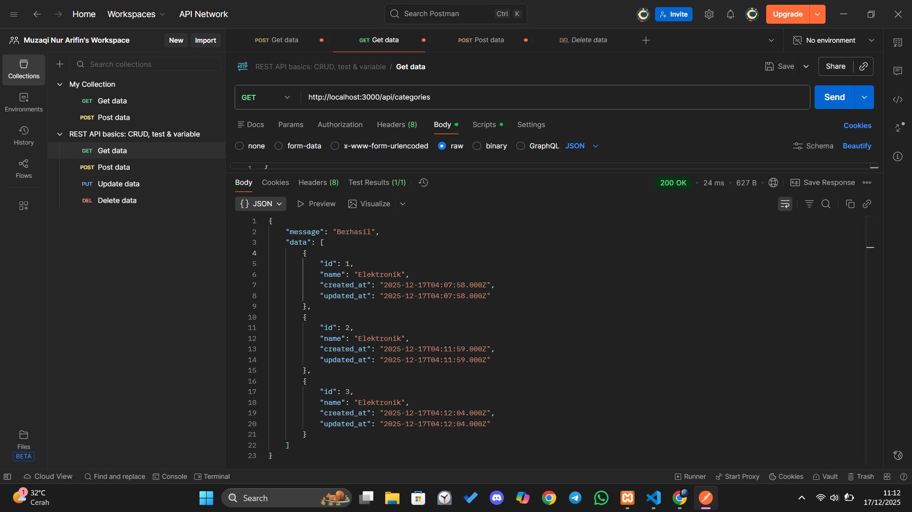

4. **POST Product**
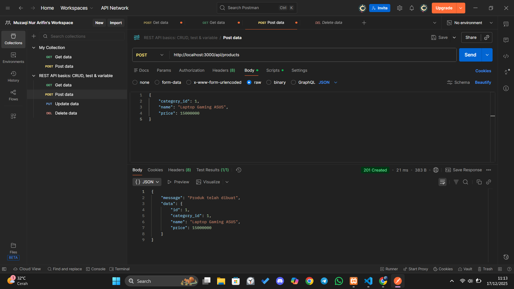

5. **GET All Products**
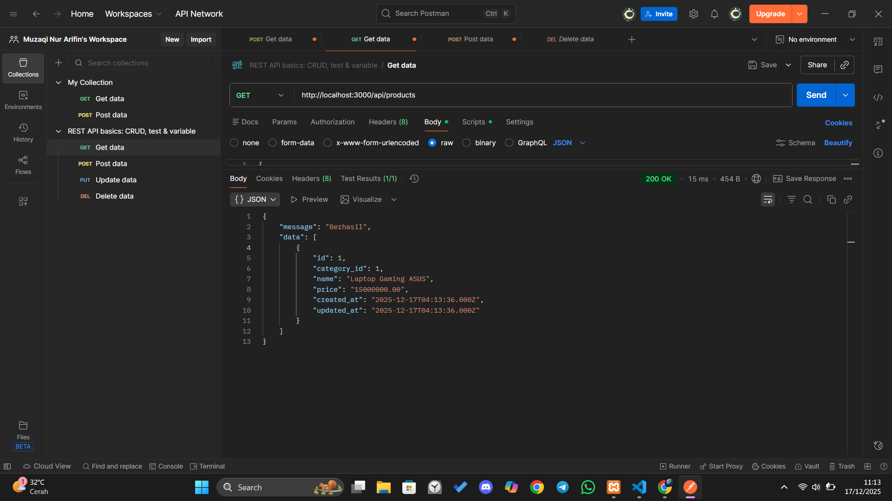

6. **PUT (Update) Product**
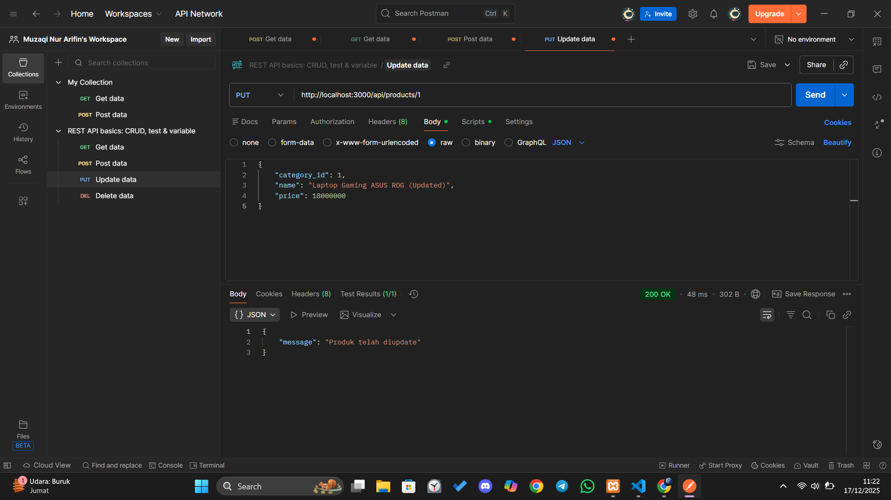

7. **DEL (Delete) Product**
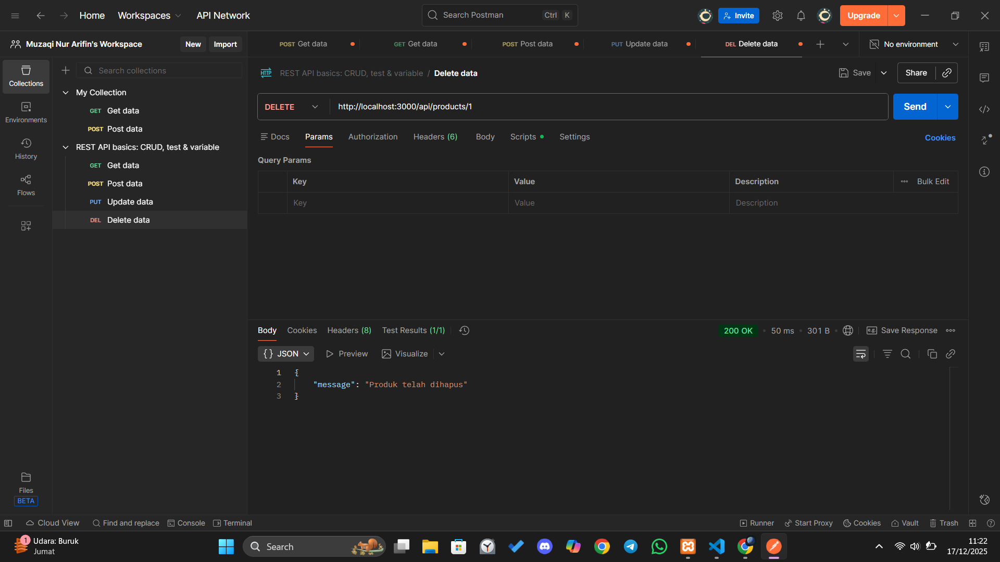

8. **Get All Users**
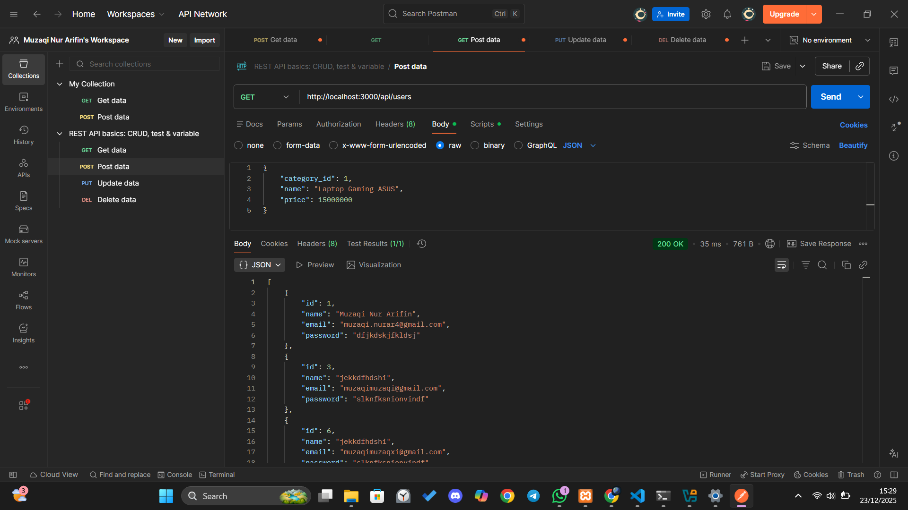

9. **Get Users by Id**
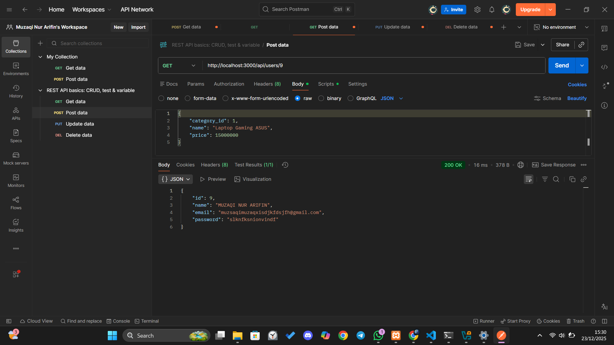

10. **POST User**
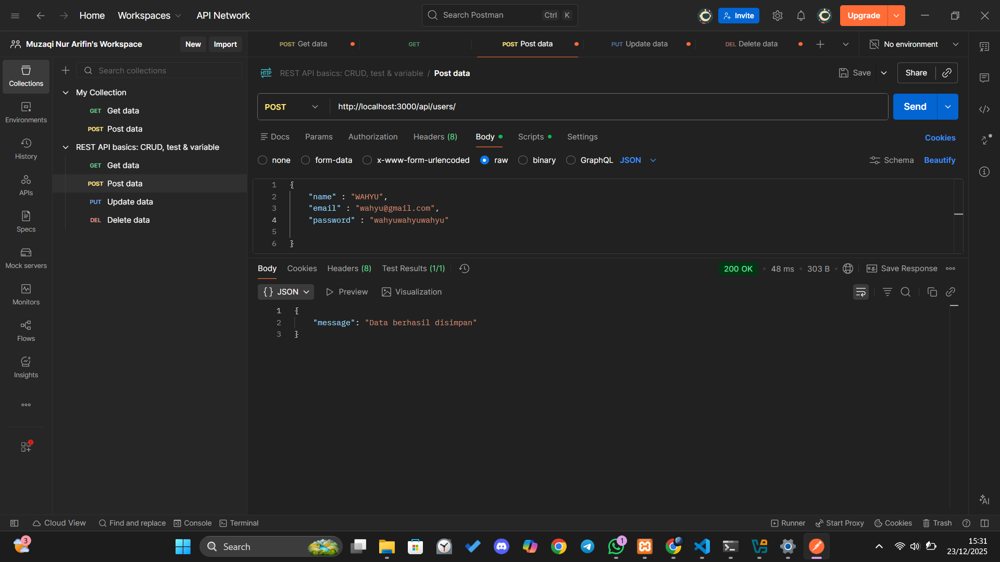

11. **PUT (Update) User**
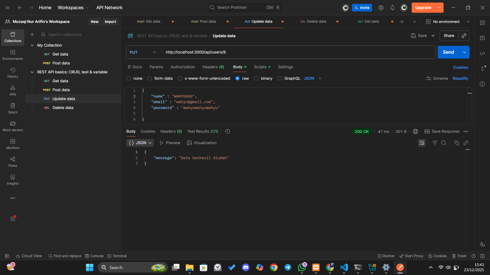

12. **DEL (Delete) User**

---

Copyright © 2025 Muzaqi Nur Arifin.

```

```
